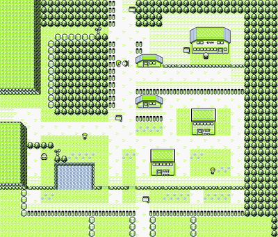
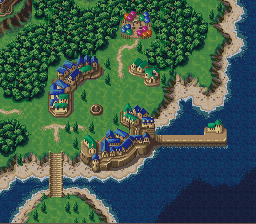
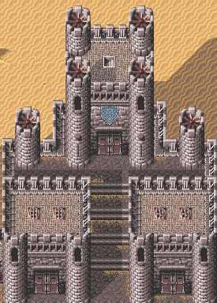
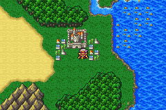
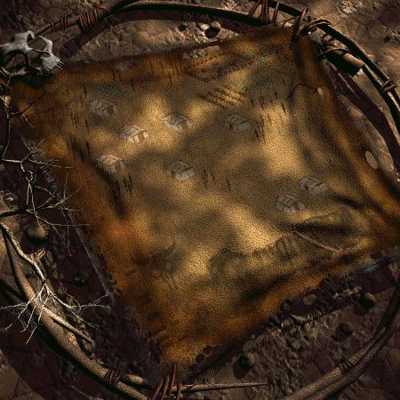
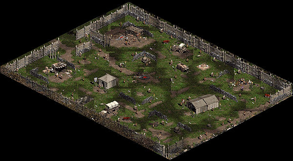
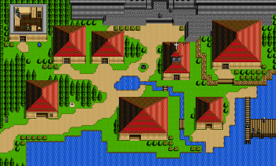

# Starting towns in various RPGs #

This document looks at starting towns in various RPGs. The purpose is to see what buildings these towns typically have, so we can come up with a minimum set of key buildings for a prototype/MVP.

### Why no Pallet Town / Narshe? ###

These towns usually have the player leaving and not returning repeatedly, since they don't have useful amenities. We want to look for examples of towns that are small and simple, but have enough amenities to act as a minor hub - where adventurers return to restock.

### Why no Athkatla? ###

These towns are too big.

### Further reading ###

http://tvtropes.org/pmwiki/pmwiki.php/Main/FirstTown

## Pokemon: Viridian City ##

- **Buildings**
	- inn/tavern (pokemon center)
	- shop
	- school (pokemon academy)
	- hall/school (gym)
	- house

## Chrono Trigger: Truce ##

- **Buildings**
	- inn (home)
	- shop
	- hall/school (mayor's building)
	- tavern/school? (leene's square)
	- house

## Final Fantasy 6: Figaro Castle ##

- **Buildings**
	- inn
	- school
	- item shop
	- equipment shop
	- hall (throne room)
	- house (jail)

## Final Fantasy 4: Baron ##

- **Buildings**
	- inn/tavern
	- school x2
	- item shop
	- equipment shop
	- hall (castle)
	- house

## Fallout 2: Arroyo ##

- **Buildings**
	- school x2
	- item shop
	- equipment shop
	- hall
	- house x2

## Nethack: Minetown (Frontier Town) ##

    ---------------------------------
    |...............................|
    |.------------.....------------.|
    |.|...|...|..|.....+..|...|...|.|
    |.|...|...|fd|.....|G.|lgt|...|.|
    |.|gen|...|..|.....|..|...|...|.|
    |.|...|...|+--.....----+---+---.|
    |.--+--+---.....................|
    |.............{......{..........|
    |.-+---+---....-+----...........|
    |.|...|...|---.|....|.-----+---.|
    |.|...|...|..+.|....|.|..|....|.|
    |.|too|...|.G|.|.._.|.+..|....|.|
    |.|...|...|..|.|....|.|..|....|.|
    |.------------.------.---------.|
    |...............................|
    ---------------------------------

- **Buildings**
	- shop (gen)
	- item shop (fd)
	- equipment shop x2 (too, lgt)

## Diablo 2: Rogue Encampment ##

An unusual setup; Diablo 2 is more about NPCs than shops. Furthermore, all NPCs give useful quest advice, which is why they are also "schools".

In Diablo 2 one can also hire mercenaries, which acts as a "tavern".

Item identification is a Western RPG concept, loosely categorised as an "item shop" here.

- **Buildings**
	- inn/shop/school/hall (Ankara)
	- equipment shop/school (Charsi)
	- shop/school (Gheed)
	- tavern/school (Kashya)
	- school (Warriv)
	- item shop/school (Deckard Cain)
	- **Totals**
		- hall
		- inn
		- shop x2
		- equipment shop
		- item shop
		- tavern
		- school x6

## Shining Force 2: Granseal ##

- **Buildings**
	- house x5
	- school
	- shop
	- hall (castle)
	- inn (church)